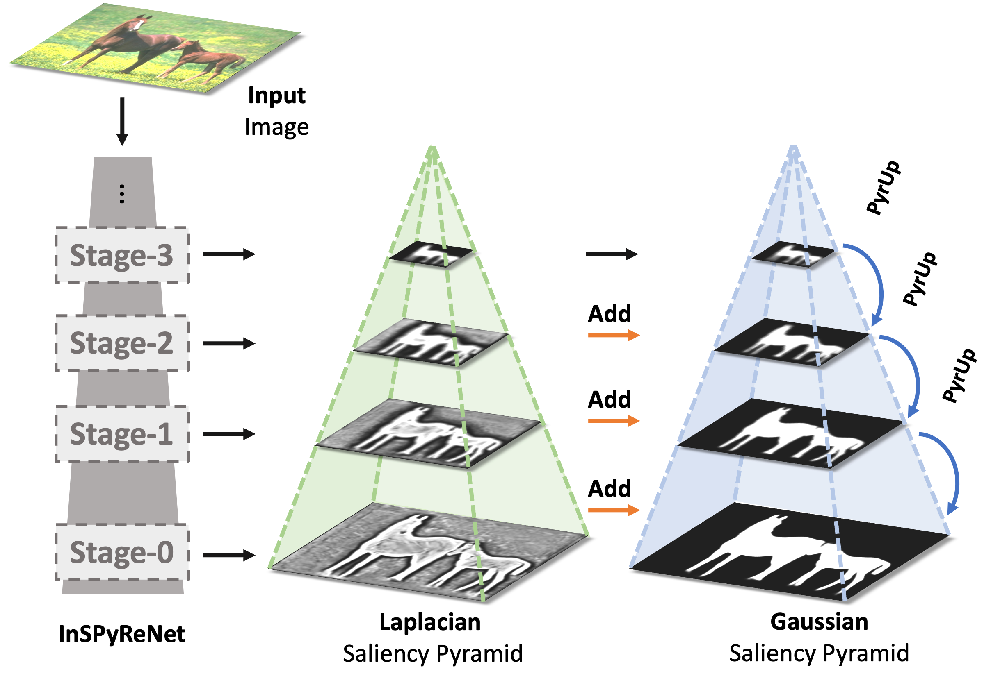
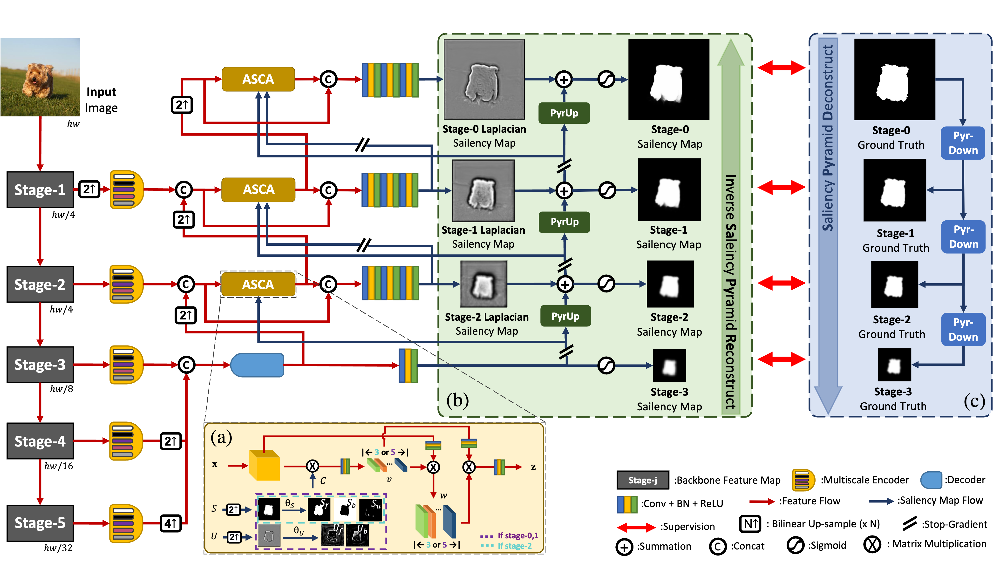
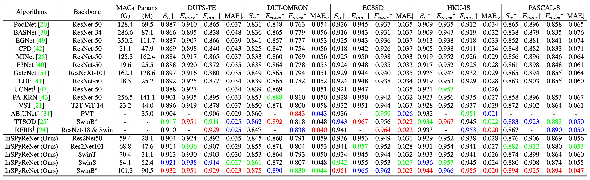
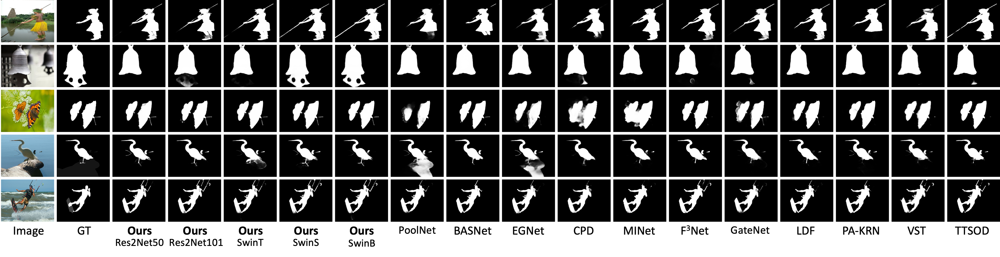
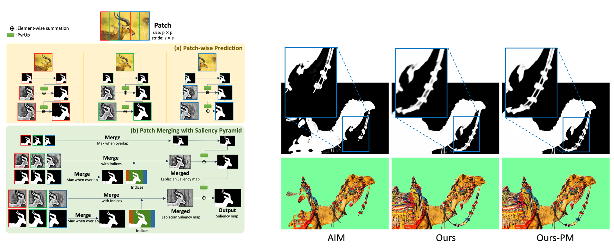

# InSPyReNet: Inverse Saliency Pyramid Reconstruction Network for Salient Object Detection
<p align="center">

  

</p>
PyTorch implementation of InSPyReNet: Inverse Saliency Pyramid Reconstruction Network for Salient Object Detection


## Abstract

Salient object detection (SOD) requires multi-scale features from intermediate backbone feature maps and carefully designed feature aggregation modules to obtain detailed saliency prediction. High-level feature maps from the backbone have high-level semantic information while lack of high frequency details like sharp edges or contours of salient objects. On the other hand, low-level feature maps from the backbone have high frequency details while lack of semantic information for accurate saliency score prediction. Rather than combining feature maps of multiple scales, we separately use them to predict the saliency map at their maximum capabilities of spatial dimension and high frequency details. Inspired by image pyramid, we propose Inverse Saliency Pyramid Reconstruction Network (InSPyReNet), a coarse to fine SOD network with Laplacian pyramid on each scale of saliency map to reconstruct a saliency map to the input image size. While image pyramids can only be constructed from the largest image to smaller scales, our method explicitly estimates Laplacian saliency map from the smallest scale and reconstructs to the larger scales. Our extensive evaluation on five public SOD benchmarks demonstrates our method surpasses the state-of-the-art performance on various SOD metrics.

## Architecture



## 1. Create environment
  + Create conda environment with following command `conda create -y -n inspyrenet python=3.8`
  + Activate environment with following command `conda activate inspyrenet`
  + Install requirements with following command `pip install -r requirements.txt`
  
## 2. Preparation
  + Use following command to automatically download datasets and checkpoints with following command `sh install.sh`. There'll be prompts for downloading datasets, backbone checkpoints, pre-trained models, SotA results, and auto-install conda environments. 
  + Instead, you can download them manually.
    + Download datasets from following [URL](https://drive.google.com/file/d/1kVR8uvjFFqR4Tx3v8XFH6Qp7ugdnBLiG/view?usp=sharing)
    + Download ImageNet pre-trained backbone checkpoints from following [URL](https://drive.google.com/file/d/1ZtBmUskX5Jmcr1ltlmfJCnwJ7JxjXG4i/view?usp=sharing)
    + Move folder `data` to the repository.
    + Folder should be ordered as follows,
  ```
  .
  ├── configs
  │   ├── ...
  │   ├── InSPyReNet_SwinT.yaml
  │   └── SotA
  ├── data
  │   ├── backbone_ckpt
  │   │   ├── ...
  │   │   └── swin_tiny_patch4_window7_224.pth
  │   ├── custom_transforms.py
  │   ├── dataloader.py
  │   └── RGB_Dataset
  │       ├── Test_Dataset                       
  │       └── Train_Dataset
  ├── Expr.py
  ├── Exprs.py
  ├── figures
  │   ├── ...
  │   └── table.png
  ├── install.sh
  ├── lib
  │   ├── backbones
  │   ├── __init__.py
  │   ├── InSPyReNet_PM.py
  │   ├── InSPyReNet.py
  │   ├── modules
  │   ├── optim
  │   └── SotA
  ├── LICENSE
  ├── README.md
  ├── requirements.txt
  ├── results
  │   ├── ...
  │   └── result_PASCAL-S.pkl
  ├── run
  │   ├── Eval.py
  │   ├── Inference.py
  │   ├── __init__.py
  │   ├── Test.py
  │   └── Train.py
  ├── snapshots
  │   ├── I...
  │   ├── InSPyReNet_SwinT
  │   └── SotA
  └── utils
      ├── benchmark.py
      ├── eval_functions.py
      ├── __init__.py
      ├── install_script.py
      └── misc.py
  ```

## 3. Train & Evaluate
  + You can train with `python run/Train.py --config configs/InSPyReNet_SwinB.yaml --verbose`
  + You can generate prediction for test dataset with `python run/Test.py --config configs/InSPyReNet_SwinB.yaml --verbose`
  + You can evaluate generated prediction with `python run/Eval.py --config configs/InSPyReNet_SwinB.yaml --verbose`. The results will be saved in `results/results_[DATASET].csv`.
  + You can also use `python Expr.py --config configs/InSPyReNet_SwinB.yaml --verbose` to train, generate prediction and evaluation in single command
  
  + (optional) Download our best result checkpoints and pre-computed saliency maps from following [URL](https://drive.google.com/file/d/1iD4ekldcivjMJ3gcenW3_kit7TCTMg_S/view?usp=sharing). Locate pth files following above file location. If you use `install.sh`, then you don't need to download them manually.
  + (optional) You can download pre-computed saliency maps from other methods and evaluate with our evaluation code. We have created some of SotA models' yaml file in `configs/SotA` folder. We also provide pre-computed saliency maps for SotA methods from following [URL](https://drive.google.com/file/d/1X0o7O-dyoLhXvncYpa4pvL6TCe171NXK/view?usp=sharing) which were brought from the official authors repositories. To create an yaml file as manually, follow the format below.
  ```
  Eval:
    gt_root: "data/RGB_Dataset/Test_Dataset"
    pred_root: "[DIR_FOR_YOUR_PRE_COMPUTED_SALIENCY_MAP]"
    result_path: "results"
    datasets: ['DUTS-TE', 'DUT-OMRON', 'ECSSD', 'HKU-IS', 'PASCAL-S']
    metrics: ['Sm', 'mae', 'adpEm', 'maxEm', 'avgEm', 'adpFm', 'maxFm', 'avgFm', 'wFm']
  ``` 

## 4. Inference on your own data
  + You can inference your own single image or images (.jpg, .jpeg, and .png are supported), single video or videos (.mp4, .mov, and .avi are supported), and webcam input (ubuntu and macos are tested so far).
  + `python run/Inference.py --config configs/InSPyReNet_SwinB.yaml --source [SOURCE] --dest [DEST] --type [TYPE] --gpu --jit --verbose`
    + SOURCE: Specify your data in this argument.
      + Single image - `image.png`
      + Folder containing images - `path/to/img/folder`
      + Single video - `video.mp4`
      + Folder containing videos - `path/to/vid/folder`
      + Webcam input: `0` (may vary depends on your device.)
    + DEST (optional): Specify your destination folder. If not specified, it will be saved in `results` folder.
    + TYPE: Choose between `map, green, rgba, blur`
      + `map` will output saliency map only. 
      + `green` will change the background with green screen. 
      + `rgba` will generate RGBA output regarding saliency score as an alpha map. Note that this will not work for video and webcam input. 
      + `blur` will blur the background.
    + --gpu: Use this argument if you want to use GPU. 
    + --jit: Slightly improves inference speed when used. 
    + --verbose: Use when you want to visualize progress.

## 4. Experimental Results
  + Benchmark on DUTS-TE, DUT-OMRON, ECSSD, HKU-IS, PASCAL-S

  + Qualitative Results 


## 5. Patch Merging
  + With our method, it is easy to merge results from patch-wise prediction. The overall process work as following figure,
  
  + Use `--PM` for `run/Inference.py` to deploy patch merging (e.g., `python run/Inference.py --config configs/InSPyReNet_SwinB.yaml --source AIM-500 --type green --gpu --verbose --PM`)
  + We conduct experiments on AIM-500 dataset. The results are provided in this [URL](https://drive.google.com/file/d/19v5k8OJrycPs-ffkIcdRv-lhaTIjatbo/view?usp=sharing). Please refer to the paper for the results.
  
## 5. Citation

+ Backbones:
  + Res2Net: [A New Multi-scale Backbone Architecture](https://github.com/Res2Net/Res2Net-PretrainedModels)
  + Swin Transformer: [Hierarchical Vision Transformer using Shifted Windows](https://github.com/microsoft/Swin-Transformer)
+ Datasets:
  + [DUTS](http://saliencydetection.net/duts/)
  + [DUT-OMRON](http://saliencydetection.net/dut-omron/)
  + [ECSSD](https://i.cs.hku.hk/~gbli/deep_saliency.html)
  + [HKU-IS](http://www.cse.cuhk.edu.hk/leojia/projects/hsaliency/dataset.html)
  + [PASCAL-S](http://cbi.gatech.edu/salobj/)
+ Evaluation Toolkit: [PySOD Metrics](https://github.com/lartpang/PySODMetrics)
+ SotA methods
  + BASNet: [Boundary-Aware Segmentation Network for Mobile and Web Applications](https://github.com/xuebinqin/BASNet)
  + CPD: [Cascaded Partial Decoder for Fast and Accurate Salient Object Detection](https://github.com/wuzhe71/CPD)
  + EGNet: [Edge Guidance Network for Salient Object Detection](https://github.com/JXingZhao/EGNet)
  + F3Net: [F3Net: Fusion, Feedback and Focus for Salient Object Detection](https://github.com/weijun88/F3Net)
  + GateNet: [Suppress and Balance: A Simple Gated Network for Salient Object Detection](https://github.com/Xiaoqi-Zhao-DLUT/GateNet-RGB-Saliency)
  + LDF: [Label Decoupling Framework for Salient Object Detection](https://github.com/weijun88/LDF)
  + MINet: [Multi-scale Interactive Network for Salient Object Detection](https://github.com/lartpang/MINet)
  + PA-KRN: [Locate-Globally-Segment-locally-A-Progressive-Architecture-With-Knowledge-Review-Network-for-SOD](https://github.com/bradleybin/Locate-Globally-Segment-locally-A-Progressive-Architecture-With-Knowledge-Review-Network-for-SOD)
  + PoolNet: [A Simple Pooling-Based Design for Real-Time Salient Object Detection](https://github.com/backseason/PoolNet)
  + VST [Visual Saliency Transformer](https://github.com/nnizhang/VST)