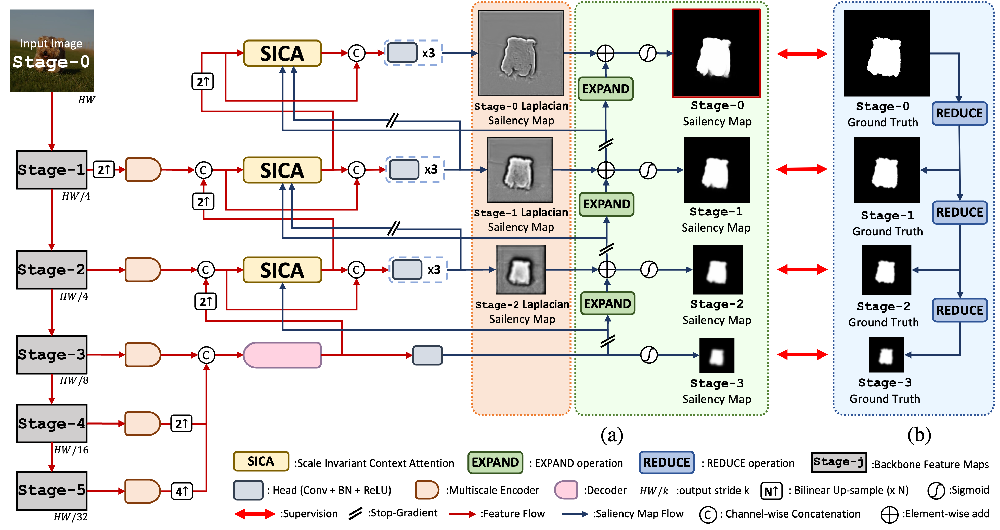
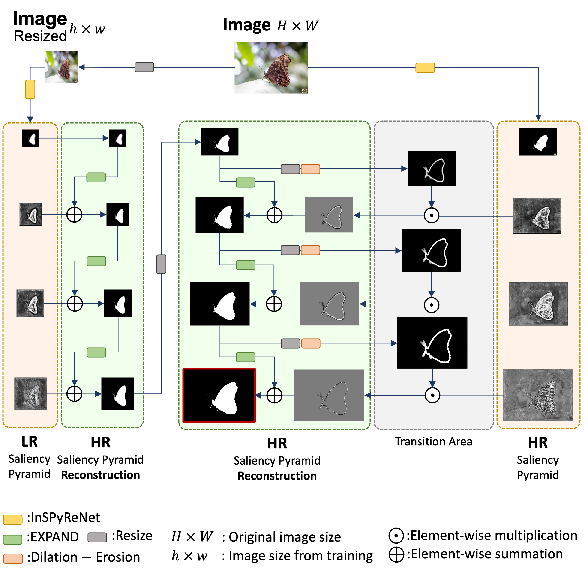
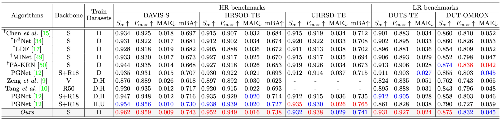
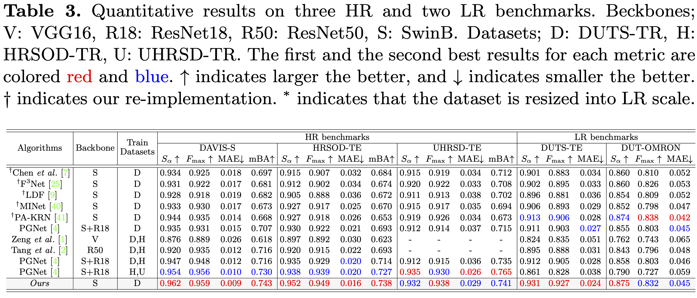

# Revisiting Image Pyramid Structure for High Resolution Salient Object Detection (InSPyReNet)

PyTorch implementation of Revisiting Image Pyramid Structure for High Resolution Salient Object Detection (InSPyReNet)

## Abstract

  Salient object detection (SOD) has been in the spotlight recently, yet has been studied less for high-resolution (HR) images. 
  Unfortunately, HR images and their pixel-level annotations are certainly more labor-intensive and time-consuming compared to low-resolution (LR) images.
  Therefore, we propose an image pyramid-based SOD framework, Inverse Saliency Pyramid Reconstruction Network (InSPyReNet), for HR prediction without any of HR datasets.
  We design InSPyReNet to produce a strict image pyramid structure of saliency map, which enables to ensemble multiple results with pyramid-based image blending.
  For HR prediction, we design a pyramid blending method which synthesizes two different image pyramids from a pair of LR and HR scale from the same image to overcome effective receptive field (ERF) discrepancy. Our extensive evaluation on public LR and HR SOD benchmarks demonstrates that InSPyReNet surpasses the State-of-the-Art (SotA) methods on various SOD metrics and boundary accuracy.

## Architecture

InSPyReNet                 |  pyramid blending
:-------------------------:|:-------------------------:
  |  

## 1. Create environment
  + Create conda environment with following command `conda create -y -n inspyrenet python=3.8`
  + Activate environment with following command `conda activate inspyrenet`
  + Install requirements with following command `pip install -r requirements.txt`
  
## 2. Preparation
URL                      |  Destination Folder
:-|:-
[Train Datasets](https://postechackr-my.sharepoint.com/:u:/g/personal/taehoon1018_postech_ac_kr/EVsFkbokdZhGu-Xc5CQaDzQBEn5YRGpTqkBF0qZJYb4PaA?e=FSytKx) | `data/Train_Dataset/...`
[Test Datasets](https://postechackr-my.sharepoint.com/:u:/g/personal/taehoon1018_postech_ac_kr/Edc1cQwr5_BItpauYpGksYcBAbaVpLFIVzWoWxrVWIJ8xg?e=Dla9fV) | `data/Test_Dataset/...`
[Res2Net50 checkpoint](https://postechackr-my.sharepoint.com/:u:/g/personal/taehoon1018_postech_ac_kr/EUO7GDBwoC9CulTPdnq_yhQBlc0SIyyELMy3OmrNhOjcGg?e=T3PVyG) | `data/backbone_ckpt/*.pth`
[SwinB checkpoint](https://postechackr-my.sharepoint.com/:u:/g/personal/taehoon1018_postech_ac_kr/ESlYCLy0endMhcZm9eC2A4ABatxupp4UPh03EcqFjbtSRw?e=7y6lLt) | `data/backbone_ckpt/*.pth`
  
  * Train with extra training datasets (HRSOD, UHRSD):
  ```
  Train:
    Dataset:
        type: "RGB_Dataset"
        root: "data/RGB_Dataset/Train_Dataset"
        sets: ['DUTS-TR'] --> ['DUTS-TR', 'HRSOD-TR-LR', 'UHRSD-TR-LR']
  ```

## 3. Train & Evaluate
  * Train InSPyReNet (SwinB)
  ```
  python run/Train.py --config configs/InSPyReNet_SwinB.yaml --verbose
  ```
  * Inference for test benchmarks
  ```
  python run/Test.py --config configs/InSPyReNet_SwinB.yaml --verbose
  ```
  * Evaluate metrics
  ```
  python run/Eval.py --config configs/InSPyReNet_SwinB.yaml --verbose
  ```

## 4. Checkpoints

### Trained with LR dataset only (DUTS-TR, 384 X 384)

Model (Link) | Backbone |  Train DB                          
:-|:-|:-
[Link](https://postechackr-my.sharepoint.com/:u:/g/personal/taehoon1018_postech_ac_kr/ERqm7RPeNBFPvVxkA5P5G2AB-mtFsiYkCNHnBf0DcwpFzw?e=nayVno) | Res2Net50 |DUTS-TR                             
[Link](https://postechackr-my.sharepoint.com/:u:/g/personal/taehoon1018_postech_ac_kr/EV0ow4E8LddCgu5tAuAkMbcBpBYoEDmJgQg5wkiuvLoQUA?e=cOZspv) | SwinB | DUTS-TR

### Trained with LR+HR dataset (with LR scale 384 X 384)

Model (Link) | Backbone |  Train DB                          
:-|:-|:-
[Link](https://postechackr-my.sharepoint.com/:u:/g/personal/taehoon1018_postech_ac_kr/EWxPZoIKALlGsfrNgUFNvxwBC8IE8jzzhPNtzcbHmTNFcg?e=e22wmy) | SwinB | DUTS-TR, HRSOD-TR-LR                
[Link](https://postechackr-my.sharepoint.com/:u:/g/personal/taehoon1018_postech_ac_kr/EQe-iy0AZctIkgl3o-BmVYUBn795wvii3tsnBq1fNUbc9g?e=gMZ4PV) | SwinB | HRSOD-TR-LR, UHRSD-TR-LR            
[Link](https://postechackr-my.sharepoint.com/:u:/g/personal/taehoon1018_postech_ac_kr/EfsCbnfAU1RAqCJIkj1ewRgBhFetStsGB6SMSq_UJZimjA?e=Ghuacy) | SwinB | DUTS-TR, HRSOD-TR-LR, UHRSD-TR-LR

* *-LR denotes resized into low-resolution scale (i.e., 384 X 384).

### Trained with LR+HR dataset (with HR scale 1024 X 1024)

Model (Link) | Backbone |  Train DB                          
:-|:-|:-
[Link](https://postechackr-my.sharepoint.com/:u:/g/personal/taehoon1018_postech_ac_kr/EW2Qg-tMBBxNkygMj-8QgMUBiqHox5ExTOJl0LGLsn6AtA?e=Mam8Ur) | SwinB | DUTS-TR, HRSOD-TR
[Link](https://postechackr-my.sharepoint.com/:u:/g/personal/taehoon1018_postech_ac_kr/EeE8nnCt_AdFvxxu0JsxwDgBCtGchuUka6DW9za_epX-Qw?e=U7wZu9) | SwinB | HRSOD-TR, UHRSD-TR

## 5. Results

* Quantitative
  * Trained with DUTS-TR only
   
  
  * Trained with extra datasets
   

* Qualitative

  * Trained with with DUTS-TR only
  
  

  * Trained with extra datasets
    
    &nbsp; | &nbsp; | &nbsp; | &nbsp;
    ------ | -----  | -----  | ----- 
    Image         | GT               | PGNet (H, U) | Ours (D, H*) 
    Ours (H*, U*) | Ours (D, H*, U*) | Ours (D, H)  | Ours (H, U) 
    
    


## 5. Citation

+ Backbones:
  + Res2Net: [A New Multi-scale Backbone Architecture](https://github.com/Res2Net/Res2Net-PretrainedModels)
  + Swin Transformer: [Hierarchical Vision Transformer using Shifted Windows](https://github.com/microsoft/Swin-Transformer)
+ Datasets:
  + [DUTS](http://saliencydetection.net/duts/)
  + [DUT-OMRON](http://saliencydetection.net/dut-omron/)
  + [ECSSD](https://i.cs.hku.hk/~gbli/deep_saliency.html)
  + [HKU-IS](http://www.cse.cuhk.edu.hk/leojia/projects/hsaliency/dataset.html)
  + [PASCAL-S](http://cbi.gatech.edu/salobj/)
  + [DAVIS-S, HRSOD](https://github.com/yi94code/HRSOD)
  + [UHRSD](https://github.com/iCVTEAM/PGNet)

+ Evaluation Toolkit: [PySOD Metrics](https://github.com/lartpang/PySODMetrics)
